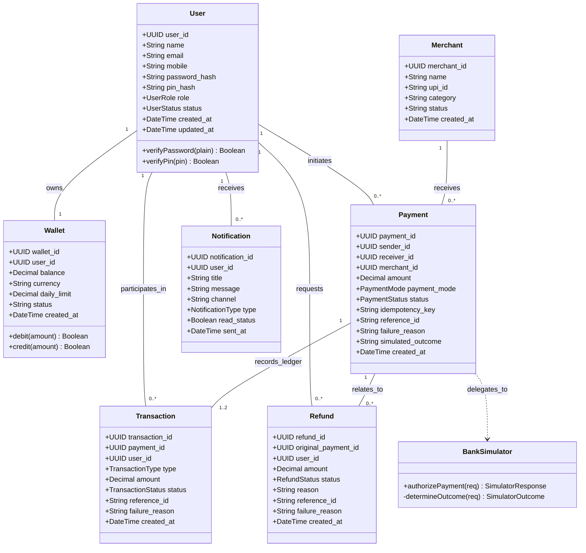

# UML Class Diagram
## Digital Payment Gateway Simulation

```mermaid
classDiagram
    class User {
        +UUID user_id
        +String name
        +String email
        +String mobile
        +String password_hash
        +String pin_hash
        +UserRole role
        +UserStatus status
        +DateTime created_at
        +DateTime updated_at
        +verifyPassword(plain) Boolean
        +verifyPin(pin) Boolean
    }

    class Wallet {
        +UUID wallet_id
        +UUID user_id
        +Decimal balance
        +String currency
        +Decimal daily_limit
        +String status
        +DateTime created_at
        +debit(amount) Boolean
        +credit(amount) Boolean
    }

    class Merchant {
        +UUID merchant_id
        +String name
        +String upi_id
        +String category
        +String status
        +DateTime created_at
    }

    class Payment {
        +UUID payment_id
        +UUID sender_id
        +UUID receiver_id
        +UUID merchant_id
        +Decimal amount
        +PaymentMode payment_mode
        +PaymentStatus status
        +String idempotency_key
        +String reference_id
        +String failure_reason
        +String simulated_outcome
        +DateTime created_at
    }

    class Transaction {
        +UUID transaction_id
        +UUID payment_id
        +UUID user_id
        +TransactionType type
        +Decimal amount
        +TransactionStatus status
        +String reference_id
        +String failure_reason
        +DateTime created_at
    }

    class Refund {
        +UUID refund_id
        +UUID original_payment_id
        +UUID user_id
        +Decimal amount
        +RefundStatus status
        +String reason
        +String reference_id
        +String failure_reason
        +DateTime created_at
    }

    class Notification {
        +UUID notification_id
        +UUID user_id
        +String title
        +String message
        +String channel
        +NotificationType type
        +Boolean read_status
        +DateTime sent_at
    }

    class BankSimulator {
        +authorizePayment(req) SimulatorResponse
        -determineOutcome(req) SimulatorOutcome
    }

    User "1" -- "1" Wallet : owns
    User "1" -- "0..*" Payment : initiates
    User "1" -- "0..*" Transaction : participates_in
    User "1" -- "0..*" Refund : requests
    User "1" -- "0..*" Notification : receives
    Payment "1" -- "1..2" Transaction : records_ledger
    Payment "1" -- "0..*" Refund : relates_to
    Merchant "1" -- "0..*" Payment : receives
    Payment ..> BankSimulator : delegates_to
```
