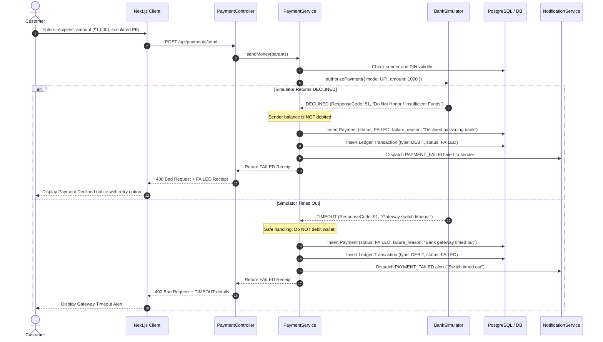

# Failed / Declined / Timeout Payment Sequence Diagram
## Digital Payment Gateway Simulation

```mermaid
sequenceDiagram
    autonumber
    actor Customer
    participant Frontend as Next.js Client
    participant Controller as PaymentController
    participant Service as PaymentService
    participant Simulator as BankSimulator
    participant DB as PostgreSQL / DB
    participant Notif as NotificationService

    Customer->>Frontend: Enters recipient, amount (₹1,000), simulated PIN
    Frontend->>Controller: POST /api/payments/send
    Controller->>Service: sendMoney(params)
    Service->>DB: Check sender and PIN validity
    Service->>Simulator: authorizePayment({ mode: UPI, amount: 1000 })

    alt Simulator Returns DECLINED
        Simulator-->>Service: DECLINED (ResponseCode: 51, "Do Not Honor / Insufficient Funds")
        Note over Service: Sender balance is NOT debited
        Service->>DB: Insert Payment (status: FAILED, failure_reason: "Declined by issuing bank")
        Service->>DB: Insert Ledger Transaction (type: DEBIT, status: FAILED)
        Service->>Notif: Dispatch PAYMENT_FAILED alert to sender
        Service-->>Controller: Return FAILED Receipt
        Controller-->>Frontend: 400 Bad Request + FAILED Receipt
        Frontend-->>Customer: Display Payment Declined notice with retry option
    else Simulator Times Out
        Simulator-->>Service: TIMEOUT (ResponseCode: 91, "Gateway switch timeout")
        Note over Service: Safe handling: Do NOT debit wallet!
        Service->>DB: Insert Payment (status: FAILED, failure_reason: "Bank gateway timed out")
        Service->>DB: Insert Ledger Transaction (type: DEBIT, status: FAILED)
        Service->>Notif: Dispatch PAYMENT_FAILED alert ("Switch timed out")
        Service-->>Controller: Return FAILED Receipt
        Controller-->>Frontend: 400 Bad Request + TIMEOUT details
        Frontend-->>Customer: Display Gateway Timeout Alert
    end
```
