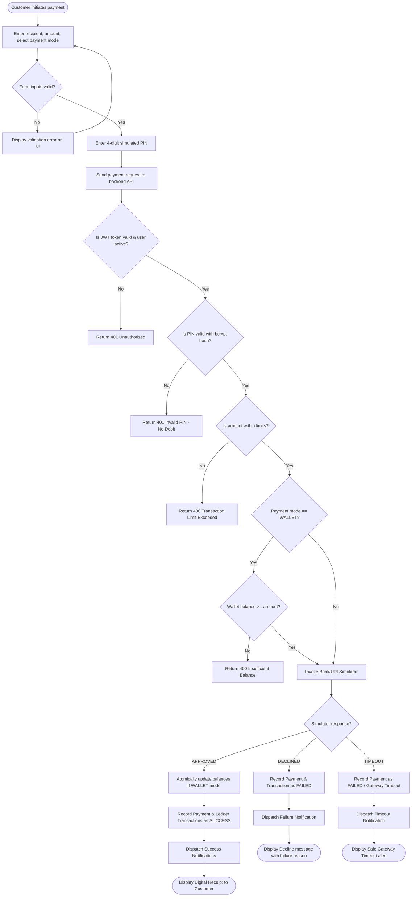

# Payment Activity Diagram
## Digital Payment Gateway Simulation

```mermaid
flowchart TD
    Start([Customer initiates payment]) --> InputDetails[Enter recipient, amount, select payment mode]
    InputDetails --> ValidateForm{Form inputs valid?}
    ValidateForm -- No --> ShowFormError[Display validation error on UI]
    ShowFormError --> InputDetails

    ValidateForm -- Yes --> PromptPIN[Enter 4-digit simulated PIN]
    PromptPIN --> SubmitAPI[Send payment request to backend API]
    SubmitAPI --> CheckAuth{Is JWT token valid & user active?}
    CheckAuth -- No --> Reject401[Return 401 Unauthorized]

    CheckAuth -- Yes --> VerifyPIN{Is PIN valid with bcrypt hash?}
    VerifyPIN -- No --> RejectPIN[Return 401 Invalid PIN - No Debit]

    VerifyPIN -- Yes --> CheckLimits{Is amount within limits?}
    CheckLimits -- No --> RejectLimits[Return 400 Transaction Limit Exceeded]

    CheckLimits -- Yes --> ModeCheck{Payment mode == WALLET?}
    ModeCheck -- Yes --> CheckBalance{Wallet balance >= amount?}
    CheckBalance -- No --> RejectBalance[Return 400 Insufficient Balance]
    CheckBalance -- Yes --> CallSimulator[Invoke Bank/UPI Simulator]
    ModeCheck -- No --> CallSimulator

    CallSimulator --> SimulatorSwitch{Simulator response?}
    SimulatorSwitch -- APPROVED --> DebitWallet[Atomically update balances if WALLET mode]
    DebitWallet --> RecordSuccess[Record Payment & Ledger Transactions as SUCCESS]
    RecordSuccess --> SendSuccessNotif[Dispatch Success Notifications]
    SendSuccessNotif --> ShowReceipt([Display Digital Receipt to Customer])

    SimulatorSwitch -- DECLINED --> RecordDecline[Record Payment & Transaction as FAILED]
    RecordDecline --> SendFailNotif[Dispatch Failure Notification]
    SendFailNotif --> ShowDecline([Display Decline message with failure reason])

    SimulatorSwitch -- TIMEOUT --> RecordTimeout[Record Payment as FAILED / Gateway Timeout]
    RecordTimeout --> SendTimeoutNotif[Dispatch Timeout Notification]
    SendTimeoutNotif --> ShowTimeout([Display Safe Gateway Timeout alert])
```
