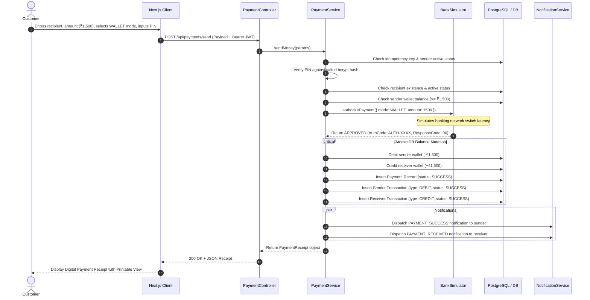

# Successful Payment Sequence Diagram
## Digital Payment Gateway Simulation

```mermaid
sequenceDiagram
    autonumber
    actor Customer
    participant Frontend as Next.js Client
    participant Controller as PaymentController
    participant Service as PaymentService
    participant Simulator as BankSimulator
    participant DB as PostgreSQL / DB
    participant Notif as NotificationService

    Customer->>Frontend: Enters recipient, amount (₹1,500), selects WALLET mode, inputs PIN
    Frontend->>Controller: POST /api/payments/send (Payload + Bearer JWT)
    Controller->>Service: sendMoney(params)
    Service->>DB: Check idempotency key & sender active status
    Service->>Service: Verify PIN against salted bcrypt hash
    Service->>DB: Check recipient existence & active status
    Service->>DB: Check sender wallet balance (>= ₹1,500)
    Service->>Simulator: authorizePayment({ mode: WALLET, amount: 1500 })
    Note over Simulator: Simulates banking network switch latency
    Simulator-->>Service: Return APPROVED (AuthCode: AUTH-XXXX, ResponseCode: 00)

    critical Atomic DB Balance Mutation
        Service->>DB: Debit sender wallet (-₹1,500)
        Service->>DB: Credit receiver wallet (+₹1,500)
        Service->>DB: Insert Payment Record (status: SUCCESS)
        Service->>DB: Insert Sender Transaction (type: DEBIT, status: SUCCESS)
        Service->>DB: Insert Receiver Transaction (type: CREDIT, status: SUCCESS)
    end

    par Notifications
        Service->>Notif: Dispatch PAYMENT_SUCCESS notification to sender
        Service->>Notif: Dispatch PAYMENT_RECEIVED notification to receiver
    end

    Service-->>Controller: Return PaymentReceipt object
    Controller-->>Frontend: 200 OK + JSON Receipt
    Frontend-->>Customer: Display Digital Payment Receipt with Printable View
```
