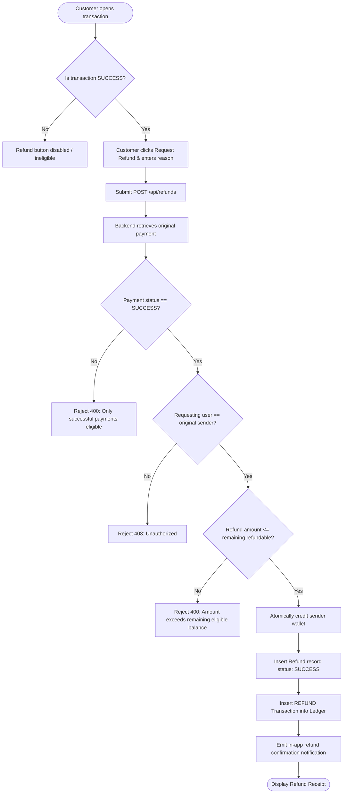

# Refund Activity Diagram
## Digital Payment Gateway Simulation

```mermaid
flowchart TD
    Start([Customer opens transaction]) --> CheckEligibility{Is transaction SUCCESS?}
    CheckEligibility -- No --> HideRefund[Refund button disabled / ineligible]
    CheckEligibility -- Yes --> RequestRefund[Customer clicks Request Refund & enters reason]
    RequestRefund --> PostAPI[Submit POST /api/refunds]

    PostAPI --> FetchPayment[Backend retrieves original payment]
    FetchPayment --> CheckOriginalStatus{Payment status == SUCCESS?}
    CheckOriginalStatus -- No --> RejectStatus[Reject 400: Only successful payments eligible]

    CheckOriginalStatus -- Yes --> CheckOwner{Requesting user == original sender?}
    CheckOwner -- No --> RejectOwner[Reject 403: Unauthorized]

    CheckOwner -- Yes --> CheckRemaining{Refund amount <= remaining refundable?}
    CheckRemaining -- No --> RejectAmount[Reject 400: Amount exceeds remaining eligible balance]

    CheckRemaining -- Yes --> CreditWallet[Atomically credit sender wallet]
    CreditWallet --> RecordRefund[Insert Refund record status: SUCCESS]
    RecordRefund --> InsertLedger[Insert REFUND Transaction into Ledger]
    InsertLedger --> EmitNotif[Emit in-app refund confirmation notification]
    EmitNotif --> End([Display Refund Receipt])
```
