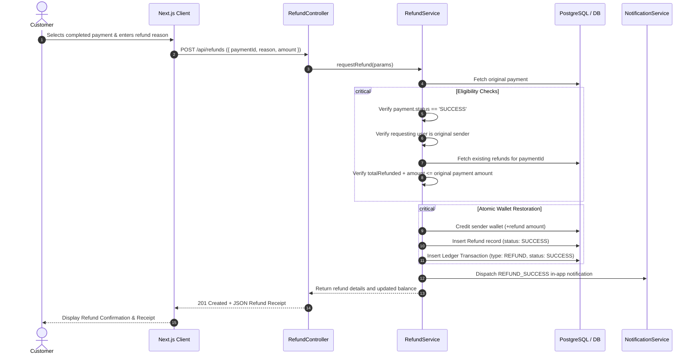

# Refund Sequence Diagram
## Digital Payment Gateway Simulation

```mermaid
sequenceDiagram
    autonumber
    actor Customer
    participant Frontend as Next.js Client
    participant Controller as RefundController
    participant Service as RefundService
    participant DB as PostgreSQL / DB
    participant Notif as NotificationService

    Customer->>Frontend: Selects completed payment & enters refund reason
    Frontend->>Controller: POST /api/refunds ({ paymentId, reason, amount })
    Controller->>Service: requestRefund(params)
    Service->>DB: Fetch original payment
    
    critical Eligibility Checks
        Service->>Service: Verify payment.status == 'SUCCESS'
        Service->>Service: Verify requesting user is original sender
        Service->>DB: Fetch existing refunds for paymentId
        Service->>Service: Verify totalRefunded + amount <= original payment amount
    end

    critical Atomic Wallet Restoration
        Service->>DB: Credit sender wallet (+refund amount)
        Service->>DB: Insert Refund record (status: SUCCESS)
        Service->>DB: Insert Ledger Transaction (type: REFUND, status: SUCCESS)
    end

    Service->>Notif: Dispatch REFUND_SUCCESS in-app notification
    Service-->>Controller: Return refund details and updated balance
    Controller-->>Frontend: 201 Created + JSON Refund Receipt
    Frontend-->>Customer: Display Refund Confirmation & Receipt
```
