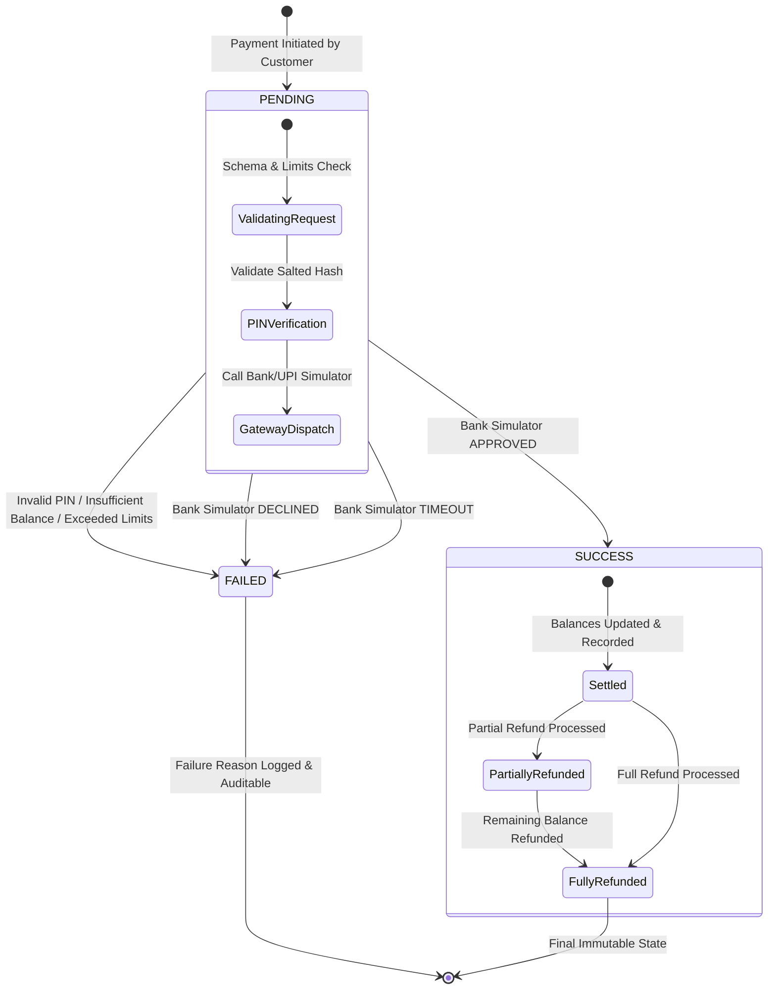

# Transaction State Chart
## Digital Payment Gateway Simulation

```mermaid
stateDiagram-v2
    [*] --> PENDING: Payment Initiated by Customer

    state PENDING {
        [*] --> ValidatingRequest: Schema & Limits Check
        ValidatingRequest --> PINVerification: Validate Salted Hash
        PINVerification --> GatewayDispatch: Call Bank/UPI Simulator
    }

    PENDING --> FAILED: Invalid PIN / Insufficient Balance / Exceeded Limits
    PENDING --> FAILED: Bank Simulator DECLINED
    PENDING --> FAILED: Bank Simulator TIMEOUT

    PENDING --> SUCCESS: Bank Simulator APPROVED

    state SUCCESS {
        [*] --> Settled: Balances Updated & Recorded
        Settled --> PartiallyRefunded: Partial Refund Processed
        PartiallyRefunded --> FullyRefunded: Remaining Balance Refunded
        Settled --> FullyRefunded: Full Refund Processed
    }

    FAILED --> [*]: Failure Reason Logged & Auditable
    FullyRefunded --> [*]: Final Immutable State
```
